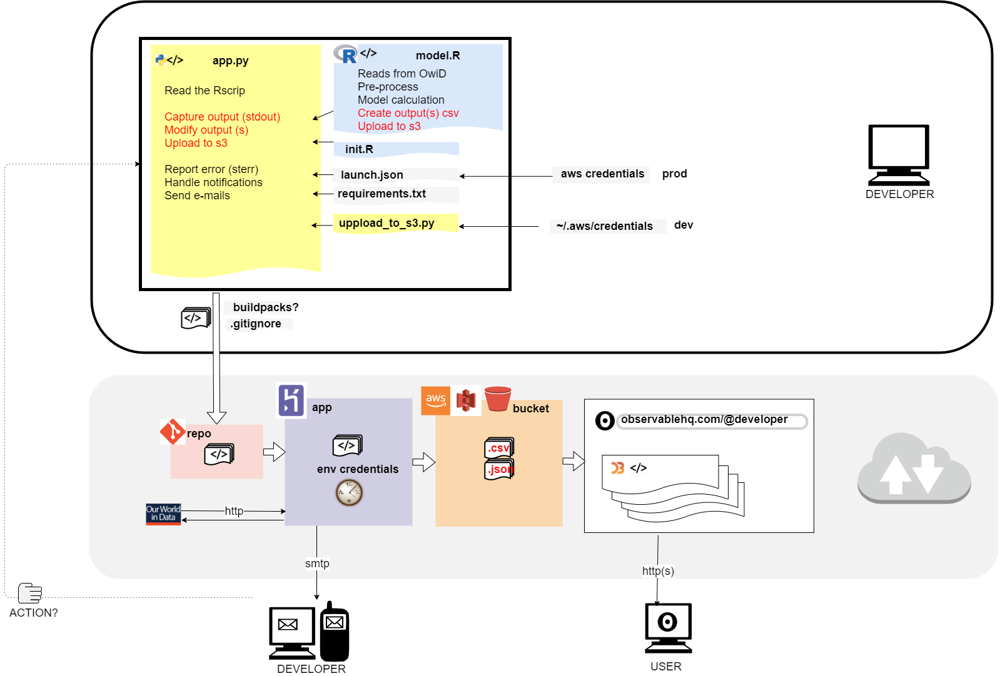

```{r setup, include=FALSE}
###--- Update the knitr working directory (R works from the project folder, knitr works in the rmd folder)

knitr::opts_knit$set(root.dir='../') 

knitr::opts_chunk$set(echo = FALSE, fig.align = 'center', comment = "#>")

library(tidyverse)
library(latex2exp)
library(egg)

```


# Introduction

## Coronavirus pandemic (COVID-19)

The project aims to set up the *infrastructure* required to fetch, analyze and publish data COVID-19 data from [Our World in Data]('https://ourworldindata.org/coronavirus')

Course modules: 

 0. [Overview]("#overview")
 1. [Statistics]("#statistics")
 2. Data engineering
 3. Data visualization

# 0. Overview {#overview}


# 1. Statistics {#statistics}

## Statistics | The dataset

The main dataset obtained from the source has been processed to ease the work with statistical model. 
Each country has been enriched with data included in an Excel file provided by the professors.


+ Identify and define data types
+ Simplify the naming of categorical variables
+ Set factors and levels (ordinal categories as well)
+ Variable `population` from the Excel file is dropped as it is outdated.
+ Ensure robust matching joining datasets by assigning country ISO codes to the Excel data. 
+ Merge datasets 

## Statistics | EDA

*Exploratory data analysis* has been made to understand the nature of the variables as well as the reliability of their values. 

- Dropping variables
- Presence of missing values
- Aggregating and summarizing the variables
- Series aggregations

## Statistics | Variables selection

Discussion to ensure reliability of the data we work with has lead to drop some variables. 

- All *weekly* aggregated data from source has been dropped.
- Variables relatively scaled to population *per thousand*. Source dataset provides wider range of variables weighed *per million*.
- `World` and `International` are redundant observations and has been removed to avoid them altering the distribution at a country level.

## Statistics | Peak into data

```{r, echo = FALSE}
df0 <- readRDS("output/merged_data.RDS") %>% as.data.frame() 
DT::datatable(head(df0))
```


## Statistics | Comparing groups (1)

* For each country, we construct a new variable called `rate`:

```{r, echo=TRUE}
data = df0 %>%
  group_by(location) %>%
  mutate(
    new_cases = replace_na(new_cases, 0),
    acc_cases = cumsum(new_cases),
    active_cases = lag(acc_cases) - lag(acc_cases, 15)
  ) %>%
  mutate(
    rate = new_cases/active_cases
  ) %>%
  select(location, date, rate)
```

## Statistics | Comparing groups (2)

* We only keep observations from Germany and France, and from April to October:

```{r, echo=TRUE}
data = data %>%
  mutate(month = lubridate::month(date)) %>%
  filter(location %in% c('Germany', 'France'), 
         lubridate::year(date) == 2020, 4 <= month, month <= 10) %>%
  mutate(month = factor(lubridate::month(date), labels = month.abb[4:10]))
```

* To detect differences between countries, we decide to do a two-sample t-test in each month:

```{r, echo=TRUE}
dttest = data %>%
  group_by(month) %>%
  nest() %>%
  mutate(
    t_test = map(data, ~t.test(rate~location, data=.x)),
    map_df(t_test, broom::tidy))
```

## Statistics | Comparing groups (3)

* To visualize the comparison between countries, we try three different approaches.

```{r}
p1 = ggplot() +
  geom_boxplot(data=data, aes(x = month, y = rate, fill = location)) +
  labs(y = 'Infectiuous rate', x = '', fill = 'Country') + 
  theme(axis.text.x = element_blank(), legend.position = 'top')

p2 = ggplot() +
  geom_point(data=dttest, aes(x = month, y = estimate)) +
  geom_segment(data=dttest, aes(x = month, xend = month, y = conf.low, yend = conf.high)) +
  geom_hline(yintercept = 0, linetype = 'dotted') +
  labs(y = TeX('$r_{France}-r_{Germany}$'), x = '') +
  theme(axis.text.x = element_blank())

p3 = ggplot() +
  geom_point(data=dttest, aes(x = month, y = statistic, col = p.value < 0.05)) +
  geom_hline(yintercept = 0) +
  geom_segment(data=dttest, aes(x = month, xend = month, y = 0, yend = statistic, col = p.value < 0.05)) +
  labs(y = 't-statistic', x = '') + 
  scale_color_manual(guide = FALSE, values = c('black', 'red'))

ggarrange(p1, p2, p3, ncol = 1)
```

## Statistics | Clustering variables
Dendrogram outlining country clusters for variable X 

image

## Statistics | Clustering series
Hello 1,2,3

## Statistics | Predictive model
Hello 1,2,3

## Statistics | Descriptive model
Hello 1,2,3

# 2. Data Engineering {#data-engineering}

## Data Engineering | Diagram of the pipeline {.centered}
{width=60%}

## Data engineering | Deploying the infrastructure
Hello 1,2,3

## Data engineering | Running R scripts
Hello 1,2,3

## Data engineering | Update model from source
Hello 1,2,3

## Data engineering | Update model accuracy
Hello 1,2,3

## Data engineering | Load output to S3
Hello 1,2,3

## Data engineering | Status notifications
Hello 1,2,3

## Data engineering | Dashboard 
<iframe width="100%" height="70%" frameborder="0"
  src="https://observablehq.com/embed/@mbostock/dashboard?cell=grid"></iframe>

Further detail on module *3. Data visualization*


# 3. Data visualization

## Data visualization | Dataset exploration

  

## Data visualization | Series offset
Hello 1,2,3

## Data visualization | Zoomable treemap
Hello 1,2,3

## Data visualization | Distanace matrix
Hello 1,2,3

## Data visualization | Model accuracy dashboard
Hello 1,2,3


------------------------------------------
# SLIDE EXAMPLES
## Slide with subtitle and common markdown sytntax | Subtitle
### Title3
#### Title4
- Bullet 1
- Bullet 2

> Quoted content

> - Quoted bullet

Highlighting a *word* and another **word** and <u>word</u>

<p style="color:red"> Custom color </p>

## Slide with code highlighting


## Slide with Plot

```{r pressure}
plot(pressure)
```

## Slide with Plot Centered {.centered}

```{r}
plot(pressure)
```

## Slide with Table

```{r, echo = FALSE}
knitr::kable(head(iris)) 
```

## Slide with datatable

```{r, echo = FALSE}
DT::datatable(iris)
```

## Center Text Vertically {.flexbox .vcenter}

Some text here

## Center Some Text Horizontally

This is not centered

<div class="centered">
This text is 
</div>

## Center All Text Horizontally {.centered}

This text should be centered.

This line as well

## Two Column {.columns-2}

{width=80%}

- Bullet A
- Bullet B
- Bullet C


## Two Column

<div style="float: left; width: 45%;">
```{r, fig.width=4.7}
ggplot(iris, aes(Sepal.Width, Sepal.Length)) + geom_point()
```
</div>

<div style="float: right; width: 45%;">
```{r, fig.width=4.7}
ggplot(iris, aes(Petal.Width, Petal.Length)) + geom_point()
```
</div>
